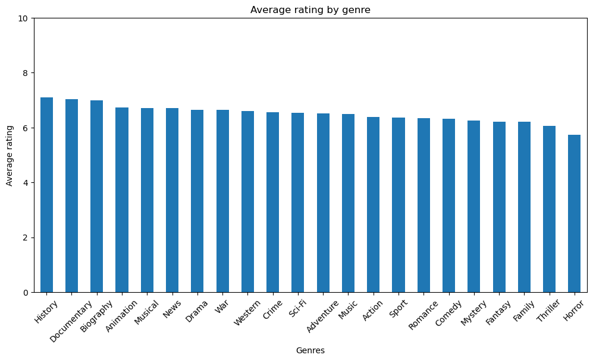
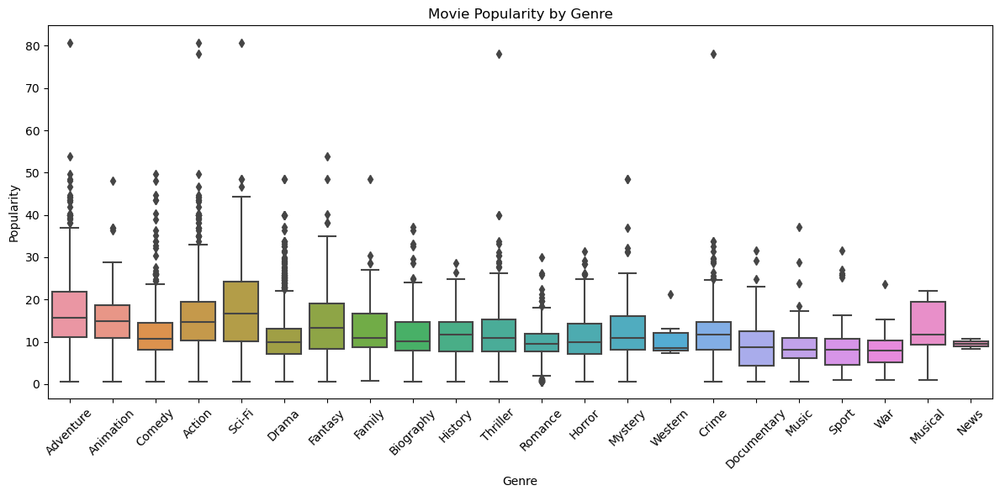
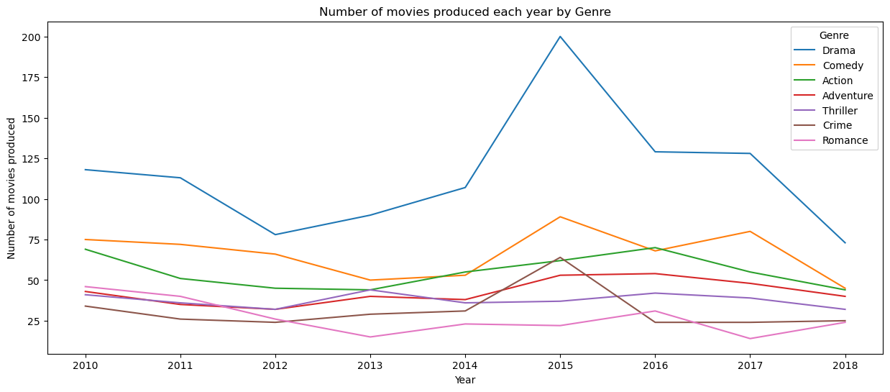
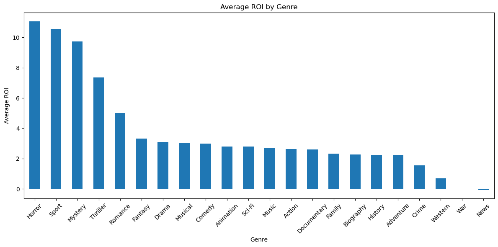

# PHASE_2_PROJECT

# PROJECT OVERVIEW
This project will leverage exploratory data analysis (EDA) to investigate box office performance data, identify key trends, patterns, and characteristics of films that have achieved commercial success. By analyzing various factors such as genre, themes, cast, production budgets, and audience demographics, we will uncover insights that can guide our film development strategy. The ultimate goal is to provide actionable recommendations to the head of our new movie studio, ensuring that our film offerings align with market demand and audience preferences. Through this analysis, we aim to position our company as a competitive player in the film industry, capable of producing engaging and profitable content that resonates with viewers.

# Business UNDERSTANDING
In the current landscape of the entertainment industry, the demand for original video content is at an all-time high. Major companies are investing heavily in film production to capture audience attention and drive revenue. Our company aims to establish a new movie studio to capitalize on this trend. However, to ensure the success of this venture, it is crucial to understand which types of films are currently performing well at the box office. This project will explore box office data to identify successful film characteristics and translate these findings into actionable insights for our new studio.

# DATA UNDERSTADING AND ANALYSIS
This project combines four movie-related datasets to create a comprehensive view of each film's financial performance, popularity, and critical reception.

**SQL Dataset (IMDb-style):**
Includes movie titles, genres, release years, average ratings, vote counts, and runtimes. Some runtime data is missing, especially for independent films.

**Movie Gross Dataset:**
Tracks U.S. and international box office revenue. Some entries have missing or invalid foreign revenue data. Major studios dominate this dataset.

**Movie Budgets Dataset:**
Provides production budget information, enabling ROI (Return on Investment) calculations when combined with gross earnings.

**TMDb Dataset:**
Adds popularity scores and exact release dates. Popularity scores vary widely and support trend analysis over time.

**Merging Process:**
All datasets were merged using a cleaned version of movie titles (clean_title) to ensure consistency. The resulting dataset includes thousands of records with combined information on revenue, budget, ratings, and popularity. Key metrics such as total_gross, ROI, and release_year were computed for analysis.

# ANALYSIS
## Average rating by genre

## Popularity by Genre

## Number of movies produced by each genre 

# Average ROI by Genre

## Tableau
https://public.tableau.com/app/profile/faith.githaiga/viz/BoxOffice_17460097972510/BoxOfficeInsights?publish=yes

# STAKEHOLDERS
**1. Executive Leadership:** Responsible for strategic decision-making and resource allocation for the new movie studio.
**2. Marketing Team:** Needs insights on audience preferences to develop effective marketing strategies.
**3. Production Team**: Requires information on successful film elements to guide the development of new projects.
**4. Finance Team:** Interested in understanding potential revenue streams and budget allocations.
**5.Data Analysts:** Tasked with conducting the analysis and presenting findings.

# CONCLUSION
This project successfully integrated multiple datasets to provide a 360-degree view of movie performance by combining critical reception, financial data, and public interest metrics. Through cleaning and merging four distinct sources—IMDb-style metadata, box office earnings, production budgets, and TMDb popularity scores—we created a robust and enriched dataset suitable for exploratory analysis and strategic insights.

**Key conclusions include:**

Higher-rated movies don’t always correlate with higher box office revenue, indicating that commercial success and critical acclaim are not always aligned.

Studios with high production budgets tend to dominate the box office, but ROI varies greatly—showing that low-budget films can still outperform in profitability.

Popularity metrics (like those from TMDb) offer predictive value, especially when combined with release trends and budget data.

The combined dataset enables deep financial modeling, including gross earnings, ROI calculations, and trend forecasting.

