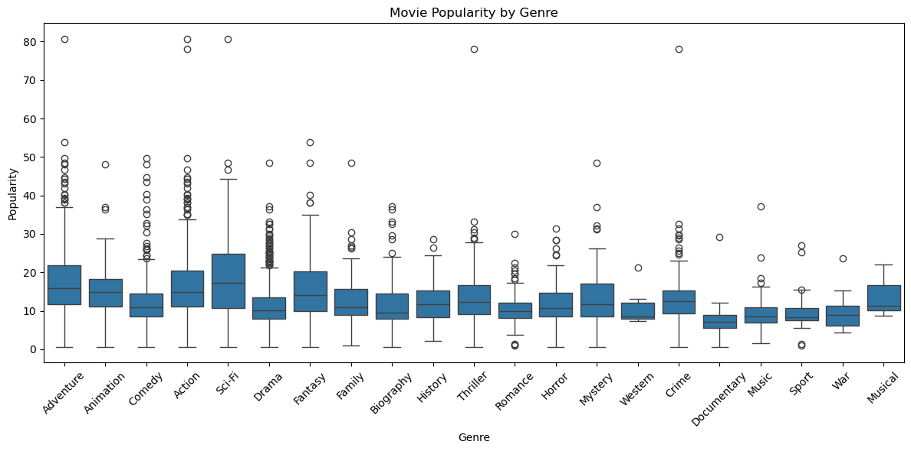

# PHASE_2_PROJECT

# PROJECT OVERVIEW
Goal:
Identify the types of films performing best in the box office and understand the factors influencing their success.

Analysis:
Used Python to merge and clean multiple movie datasets, calculate profit and ROI, and run visualizations and statistical tests to uncover what drives box office success.

Deliverable:
Provide insights on the most profitable genres, budgets, and release timings to guide future video content production and help producers make data-driven decisions for maximizing box office returns.

# Business UNDERSTANDING
Business Goal:Identify which types of films perform best across key performance metrics — such as ratings, popularity, and return on investment (ROI)

Stakeholders:Studio investors, studio executives, distribution strategists and movie producers

Key Questions:
Which movie genres are the most popular among audiences?
Which months are the best for releasing movies to maximize performance?
What is the ideal budget range for a film to attract popularity or success?
Which genres yield the highest return on investment (ROI)?
Business Goal:Identify which types of films perform best across key performance metrics — such as ratings, popularity, and return on investment (ROI)

Stakeholders:Studio investors, studio executives, distribution strategists and movie producers

Key Questions:
Which movie genres are the most popular among audiences?
Which months are the best for releasing movies to maximize performance?
What is the ideal budget range for a film to attract popularity or success?
Which genres yield the highest return on investment (ROI)?

# DATA UNDERSTADING AND ANALYSIS

Datasets Used and Data used:
IMDb (SQL database): rating, genre and runtime
Box Office Mojo csv: domestic revenue and foreign revenue
The numbers csv: production budget
The Movie Db csv: popularity score, release date

Challenges:
The budget wasn’t available for all films
No universal movie identification index

# ANALYSIS
#### Movie Popularity by Genre

The above figure above concludes that, Adventure, Action, and Sci-Fi emerged as the most popular genres  

#### Average Rating by Genre

The above figure concluded that, History, Documentary, and Biography emerged as the highest-rated genres.

#### Median ROI By Budget Group

From the above figure we concluded that the median ROI increases as the budget increases.

## Tableau
https://public.tableau.com/app/profile/faith.githaiga/viz/BoxOffice_17460097972510/BoxOfficeInsights?publish=yes

# STAKEHOLDERS
**1. Executive Leadership:** Responsible for strategic decision-making and resource allocation for the new movie studio.
**2. Marketing Team:** Needs insights on audience preferences to develop effective marketing strategies.
**3. Production Team**: Requires information on successful film elements to guide the development of new projects.
**4. Finance Team:** Interested in understanding potential revenue streams and budget allocations.
**5.Data Analysts:** Tasked with conducting the analysis and presenting findings.

# CONCLUSION
### Horror, mystery and thriller movies had the highest ROI, showing these types of films had the most (relative) commercial success.

### Adventure, action, and sci-fi were the most popular genres, but not the most profitable .

### Movies released in May, November and July performed the best in terms of viewership.

### Higher budget films tended to yield higher ROI, but a high budget didn’t always guarantee high returns.

# Trello Link
https://trello.com/b/qHiJCiSx/movie-analysis?utm_source=eval-email&utm_medium=email&utm_campaign=board-invite